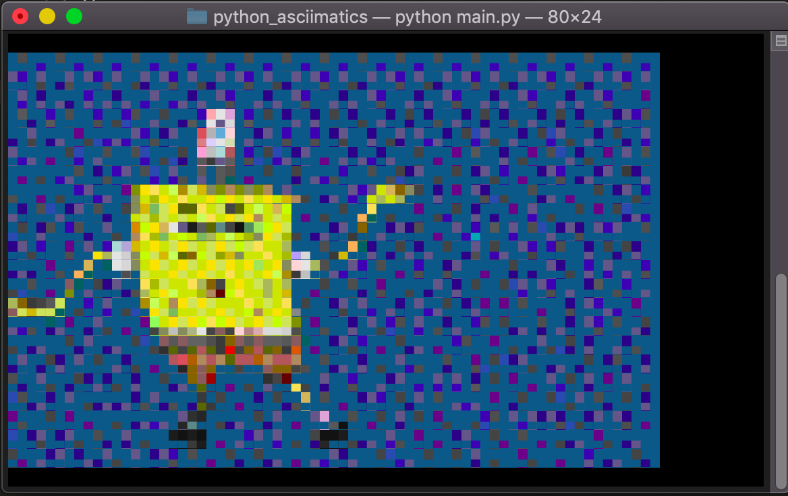
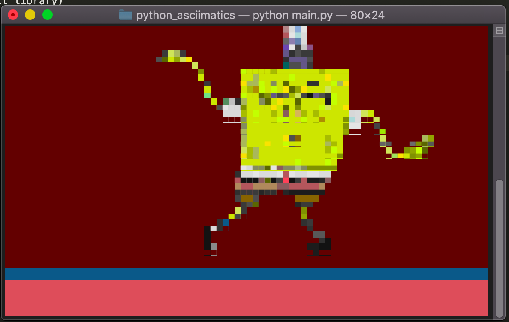
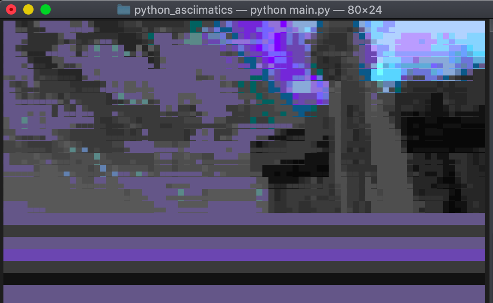
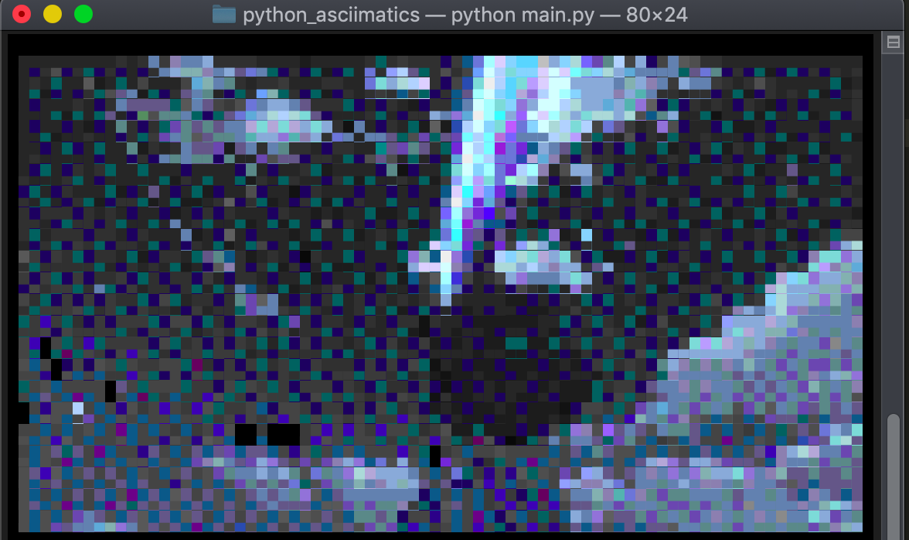
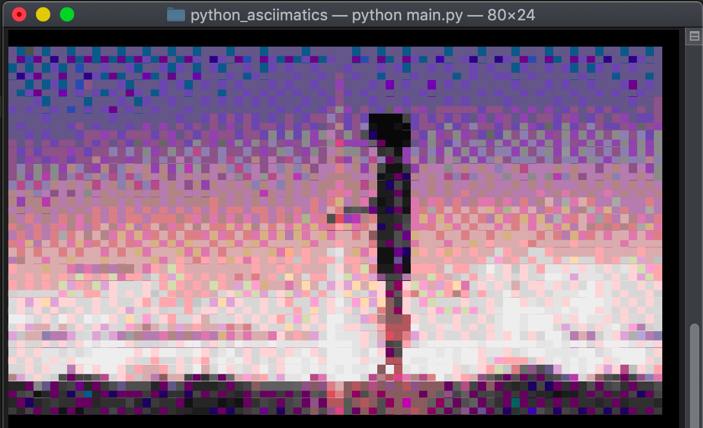

# python_asciimatics
show image animation gif, png, jpg in python

# Instalation
1. pip install asciimatics (https://pypi.org/project/asciimatics/)
2. run main.py in terminal

# Screenshoot
 
 
 
 
 